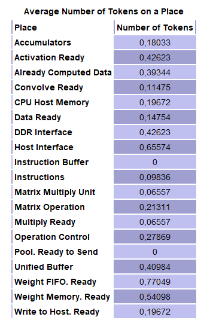
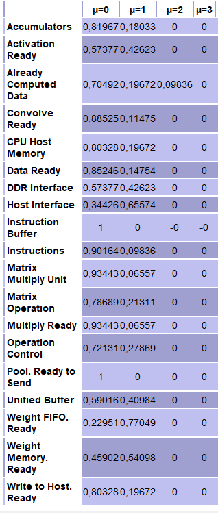

# 21741 - Arquitectures Avançades

## [***Petri Nets***](https://github.com/aNDREUET648/aa.aa_PetriNets)


## Taula de continguts
- [Introducció](#introducció)
- [Enunciat](#enunciat)
- [Requisits mínims](#requisits-mínims)
- [Xarxa de Petri](#xarxa-de-petri)
- [El model](#el-model)
- [Funcionament](#funcionament)
- [Particularitats](#particularitats)
- [Bibliografia i Eines](#bibliografia-i-eines)

### Introducció

   El ràpid desenvolupament del *Deep Learning* ha fet que ens adonem que els processadors originals ja no poden realitzar càlculs específics a gran escala amb la premura que requerim.

   En 1965, Gordon Moore va predir que el nombre de transistors per xip es duplicaria cada un o dos anys, ja no comptam amb l'*Escala de Dennard* per que ja no s'aplica. Ja em substituït el processador únic per múltiples nuclis, però encara així les millores cost-rendiment i eficiència energètica per a arquitectures de propòsit general és limitat (límits d'electromigració, mecànics i tèrmics dels xips). 

   Si volem un major rendiment (més operacions/segon), necessitam reduir l'energia/operació i a la vegada augmentar el nombre d'operacions aritmètiques/instrucció d'una a centenars. Aquesta desesperació per aconseguir aquest nivell d'eficiència és la raó pel que els arquitectes han realitzat un canvi dràstic en l'arquitectura dels ordinadors passant dels nuclis de propòsit general a les *Arquitectures de Domini Específic (DSA)*.
   
   Aquesta nova normalitat és que un ordinador estigui format per processadors estàndard per a executar programes convencionals, com els sistemes operatius, junt amb *processadors específics de domini* que només realitzin un rang estret de tasques, però que les fa extremadament ràpid i bé. Per tant, aquests ordinadors seran molt més heterogenis que els xips multinucli homogenis del passat.
   
   Un disseny representatiu en materia de DSA és la *[Unitat de Processament Tensorial de Google (Tensor Processing Unit)](https://en.wikipedia.org/wiki/Tensor_Processing_Unit)*. La Unitat de Processament Tensorial (TPU) es va implantar per primera vegada al 2015 i actualment proporciona serveis a més de mil milions de persones. La TPU fa servir una unitat d'acceleració de càlcul matricial basat en un disseny de matriu sistòlica que accelera el càlcul de les Xarxes Neuronals Profundes (Deep Neural Networks. DNN) entre 15 i 30 vegades més ràpid i amb una eficiència energètica entre 30 i 80 vegades superior a les CPUs actual i les GPUs de tecnologies similars.

   Si bé encara segueix essent vàlida, la *Llei de Moore* està arribant a la seva fi, deixant a les *Arquitectures de Domini Específic (DSA)* el pes del futur de la informàtica.
      

---

### Enunciat

Implementació d'una Xarxa de Petri per a modelar l'arquitectura d'una *Unitat de Processament Tensorial de Google*.

El document [Arquitectura de la TPU](./DSA-TPU_architecture.pdf) recull tota la informació aconseguida per a la realització de la pràctica. 


---
### Requisits mínims

Per a poder executar la pràctica cal instal·lar l'eina PIPE 2.7 *(Platform-Independent Petri net Editor)* i seguir les següents pases:
  - Descarregar i descomprimir l'arxiu comprimit *.zip* [```Pipe 2.7```](./pipe2.7/pipe2.7%5B20131028%5D.zip).  
  - Descarregar la pràctica, Xarxa de Petri a analitzar. Per fer-ho seguim les següents pases:
      - Clicar aquest enllaç: [```TPU ARCHITECTURE v.2.3.xml```](./TPU%20ARCHITECTURE%20v.2.3.xml)
      - A la part superior dreta tenim el botó Raw, ho clicam.
   
      - En aquesta nova finestra li donam amb la tecla dreta del ratolí i seleccionam ```Guardar como...``` (```Ctrl + S```)
   
  - Per a l'execució de la versió *Windows*, executar s'arxiu ```pipe.bat```
  - Per a l'execució de la versió *linux*, executar ```pipe.sh```
  - Obriu l'arxiu ```TPU ARCHITECTURE v.2.3.xml```

---
### Xarxa de Petri

Una representació de la Xarxa de Petri per a la nostra TPU és la següent:


---

### El model

   La xarxa està bassada en la TPUv1, que es d’on he obtingut tota la informació.

   Implementar una TPU completa pot ser una feina complicada. Per tal de reduir la càrrega de treball i millorar la seva viabilitat es requeriran una sèrie de simplificacions per a la TPU. Totes les simplificacions han de ser tal que, no han de perdre el concepte de disseny de la pròpia TPU.

   Degut a que el Control és la part que menys comentada, centraré el focus d'atenció de la Xarxa de Petri en aquesta direcció, i més concretament en l'execució de les instruccions que impliquen l'execució de la resta de blocs de la TPU.

   Al hardware de la TPU, la càrrega de pesos i instruccions, la lectura del *CPU Host Memory*, l’escriptura al *CPU Host Memory*, els càlculs de les multiplicacions, convolucions i activacions (per l’operació de les funcions no lineals) són operacions que no són instantànies, requereixen d’un temps. Aquestes transicions les definirem com a temporitzades per a simular millor el seu comportament. Així tenim que carregar els pesos de la DRAM durarà més que carregar una instrucció o realitzar una multiplicació de matrius. La següent taula mostra aquestes transicions temporitzades i la seva taxa amb ordre descendent de prioritat:

| Transició |Prioritat | 
| -------- | ---------- |
|   Compute. Add & Multiply    | 4  |
|   Compute. Activation    | 4  |
|   Load Instruction  | 3  |
|   Load Weights    | 2  |
|   DMA Controller. Load from Host  | 2  |
|   DMA Controller. Write to Host | 1 |

   La resta de transicions (immediates), tot i llevat que la durada es 0, he definit en aquestes transicions unes prioritats. Si dues transicions estan habilitades per un determinat marcat, se dispararà abans la de major prioritat. Per exemple, és més important la instrucció de lectura de la memòria de la CPU que la instrucció de multiplicar. Aquestes prioritats poden arribar a ser tan  restrictives que l’execució de cada una de les transicions podria arribar estar limitada a una possibilitat cada vegada. Per a que no sigui una execució pràcticament guiada (a on després d’una transició tinguem possibilitat de només dispara una altra), he definit prioritats iguals a certes transicions, així, ens trobarem per exemple habilitades les transicions `Write_Host_Memory` i `Send to Unibuffer`.

   A l’hora d’explicar el funcionament de la xarxa fent referència a les transicions, per a poder distingir entre immediates i temporitzades indicaré entre parèntesi `(I)` i `(T)` respectivament.

### Funcionament

   La xarxa va  rebent instruccions del lloc `Instructions` limitada amb un marcatge inicial de 30 (la TPU només rebrà com a màxim 30 instruccions) i es van carregant a través de  la transició *`Load Instruction(T)`* i les va depositant en el lloc *`Instruction Buffer`*. Per tal de no acabar carregant totes les instruccions al lloc també ho he limitat amb una capacitat màxima de 4 (k=4).

#### Els pesos
   La transició *`Read_Weights(I)`*, serà l’encarregada de preparar al lloc *`Weight Memory_Ready`*  (a on se li carrega l’adreça a on ha d’anar a cercar). Quan ja la té, mitjançant la transició *`Load_Weights(T)`* la va a cercar a la DRAM i la deixa al lloc *`DDR Interface`*, d’aquest mode habilitarà la transició *`Fetch_Weights(I)`* que quan es dispari deixarà carregat els pesos al lloc *`Weight_FIFO_Ready`*, just preparat per esser tractats pel lloc *`Matrix Multiply Unit`*.

#### L’activació d’entrada
   La transició *`Read_Host_Memory(I)`*, carregarà del lloc *`CPU Host Memory`* les dades d’activació d’entrada (tingui una marca/token al seu lloc) i quan el lloc *`Host Interface`* estigui disponible (tingui una marca/token). En aquest moment estarà habilitada per disparar. Quan això ocorri el lloc *`Data Ready`* tindrà les dades disponibles i habilitarà la transició *`DMA Controller. Load from Host(T)`* que quan es dispari carregarà les dades al lloc *`Unified Buffer`* a punt per esser tractades al  lloc *`Matrix Multiply Unit`*.

#### Les operacions
   La transició *`Matrix Multiply/Convolve(I)`* carregarà al lloc *`Matrix Operation`* la informació del tipus d’operació. Tant per habilitar la transició *`Multiply(I)`* com la transició *`Convolve(I)`* el lloc *`Operation Control`* ha de tenir una marca, que inicialment la té i la tornarà a tenir quan s’hagin escrit les dades processades al Host (a través de la transició *`DMA Controller Write to Host(T)`*). 
   Si es dispara la transició *`Multiply(I)`*, deixarà al lloc *`Multiply Ready`* tota la informació per a començar a operar al lloc *`Matrix Multiply Unit`*.
   Si es dispara la transició *`Convolve(I)`*, deixarà al lloc *`Convolve Ready`* les dades (kernel,...) per realitzar la convolució al lloc *`Accumulators`*.

#### L’Activació
La transició *`Activate(I)`* serà l’encarregada de deixar al lloc *`Activation Ready`* la informació necessària per realitzar ses funcions no lineals. 

#### L’escriptura
   La transició *`Write_Host_Memory(I)`* s’habilitarà quan totes les dades estiguin ja computades i això ho tindrem quan lloc *`Already Computed Data`* tingui una marca i quan tinguem el lloc *`Host Interface`* disponible (tingui una marca). En aquest cas, el lloc *`Write to Host Ready`* quedarà marcat dient que està a punt per escriure si. 

   La transició encarregada per escriure al lloc *`CPU Host Memory`* és la *`DMA Controller Write to Host(T)`* que s’habilitarà quan ell lloc *`Already Computed Data`* tingui una marca, al lloc *`Unified Buffer`* tinguem les dades preparades (amb un token) que anteriorment li ha enviat la transició *`Send to Unibuffer(I)`* i el lloc *`Write to Host Ready`* també estigui marcat. Quan es dispari, el lloc *`Host Interface`* rebrà el token per a confirmar que es pot tornar a llegir o escriure i el lloc *`CPU Host Memory`* rebrà les dades (rebrà el token) i tornarà a estar disponible. 

#### La Matriu i les ALUs
   La transició *`Systolic Control(I)`* s’habilitarà quan el lloc *`Weight FIFO Ready`* tingui els pesos (token), al lloc *`Unified Buffer`* tinguem les dades d’activació d’entrada (token) i al lloc *`Multiply Ready`* tenguem el tipus de multiplicació que hem de fer (token). Quan la transició es dispari el lloc *`Matrix Multiply Unit`* tindrà tota la informació necessària per començar a operar (lloc marcat).

   És el moment d’operar i d’això s’encarregarà la transició *`Compute Add & Multiply(I)`* que una vegada disparada marcarà el lloc Accumulators a on tindran totes les dades per poder ser tractades i d’això s’encarregarà la transició *`Compute Activation(T)`*.
Una altra forma d’arribar al lloc *`Accumulators`* com ja he comentat a l’apartat Les operacions és a través de la transició (operació) *`Convolve(I)`*. La transició *`Convolve Fetch Data(I)`*, realitzarà la convolució, on recull les dades del lloc *`Unified Buffer`* i del lloc *`Convolve Ready`*, només així carregarà tota la informació al lloc *`Accumulators`* .

   Una vegada tenim habilitada la transició *`Compute Activation(T)`*, quan es dispari, enviarà al lloc *`Pool Ready to Send`* les dades per enviar-les al llloc *`Unified Buffer`* mitjançant la transició *`Send to Unibuffer(I)`*. També avisarà al lloc *`Already Computed Data`* (mitjançant un marcat de 2 tokens) que ja ha acabat i es poden escriure les dades.

---

### Resultats obtinguts

   Per a veure resultats de la xarxa de Petri faig servir el mòdul d’anàlisi a on obtindrem el nombre mitjà de tokens a un lloc:
Amb la finalitat de millorar l’eficàcia de les Xarxes de Petri Estocàstiques (SPN), apareixen les Xarxes de Petri Estocàstiques Generalitzades (GSPN Analysis). A més de les transicions temporitzades, s’introdueixen les transicions immediates. Aquest és el nostre cas i per a veure els resultats faig servir el mòdul d’anàlisi de Xarxes de Petri Estocàstiques Generalitzades (GSPN Analysis).

   Com a  el temps de permanència en les marques en les que s’habilita almenys una transició immediata, no segueix una distribució exponencial. Aquestes marques canvien immediatament (es disparen amb una retard 0). No obstant això, la distribució de temps de permanència del procés a les marques a on només s’habiliten transicions temporitzades és exponencial.

   Per tant, es pot calcular el rendiment de cada transició (el nombre mitjà de dispars en estat estacionari), però s’ha d’adoptar una perspectiva diferent segons es tracti d’una transició temporitzada o immediata.


La mitjana de tokens a un lloc:

   <p align="center">  </p>

El rendiment de les transicions temporitzades:

   <p align="center">  </p>

La densitat de probabilitat de tokens a un lloc:

   <p align="center">  </p>
   
   Com veiem a la taula, el lloc Already Computed Data és l’únic que pot arribar a tenir fins a 2 tokens amb una densitat de probabilitat de 0.09836, la resta de llocs, quan µ=0 o µ=1 té sentit parlar-ne (tenim informació). Els casos més enllà de que hi hagi 3 tokens a un lloc no són possibles pel que serà necessari visualitzar la resta de la taula (µ=30).
   
   A l’hora de analitzar la xarxa, la modificació del Weight a les transicions immediates,  no ha afecta en res a cap del resultats vists anteriorment a les taules de més a dalt. Aquestes transicions (immediates) modifiquen el comportament de la xarxa quan es veu modificada la seva prioritat, i és lògic, estem decidint el dispar d’una transició per a un marcat de la xarxa determinat. La prioritat d’una sèrie de transicions habilitades decidirà quina ho farà abans.
   
   Mirant els nombres obtinguts és fàcil adonar-se que:
   -	El rendiment de la transició temporitzada DMA Controller. Write to Host (0.19672) està relacionat amb els llocs adjacents.
   -	La mitjana de tokens als llocs Write to Host Ready i CPU Host Memory, és la mateixa (0.19672).
   -	Aquesta mitjana és exactament la densitat de probabilitat d’haver un token al lloc (µ=1). Per tant, a la taula de densitat de probabilitat de tokens a un lloc apareixeran aquest nombre.
   -	Aquest nombre també coincidirà (i és normal) amb la densitat de probabilitat de haver un token al lloc Already Computed Data. Totes les dades que ja estan computades s’escriuran sempre al CPU Host i no li quedarà més remei que passar a través de la transició DMA Controller. Write to Host.
   -	Un altre semblança és la densitat de probabilitat d’un token al lloc Matrix Multiply Unit és la mateixa que al lloc Multiply Ready i també és evident.   

---

### Particularitats

M’he adonat que l’execució de l’eina PIPE2 v2.7 a la mateixa versió del sistema operatiu (en aquest cas Windows 10) té diferents comportaments depenent del tipus d’ordinador. El cas és que l’execució damunt qualsevol dels dos portàtils que tinc, a l’hora de modificar les prioritats de les transicions immediates no és veuen, en canvi en els ordinadors de sobretaula si que funcionen.


Les prioritats des d'un ordinador portàtil no es visualitzen


Selecció de les prioritats des d'un ordinador sobretaula


Una altra cosa ha estat que si des de github descarrego directament l’arxiu .XML de la xarxa en realitat el que em descarrega es un arxiu amb contingut html que poc té que veure amb la pràctica i si ho intent obrir des de PIPE2 em dona un error de null pointer. A l’apartat [Requisits mínims](#requisits-mínims) he deixat explicat com descarregar-lo correctament per tal de que no ocorri aquesta situació.


Missatge d'error de PIPE


---

### Bibliografia i Eines

  - [Computer Architecture: A Quantitative Approach](https://www.elsevier.com/books/computer-architecture/hennessy/978-0-12-811905-1) - Chapter 7. Domain-Specific Architectures
  - [A domain-specific architecture for deep neural networks](https://dl.acm.org/doi/pdf/10.1145/3154484) - Communications of the ACM, September 2018, Vol. 61 No. 9, Pages 50-59
  - [Google Cloud TPU](https://cloud.google.com/tpu) - Pàgina presentació de Google TPU. Inclou sa Demo/Presentació NEXT TPU
  - [Petri Nets. Properties, Analysis and Applications](./Murata%20-%20Petri%20Nets%20-%20Properties%2C%20Analysis%20and%20Applications.pdf) - Proceedings of the IEEE ( Volume: 77, Issue: 4, April 1989). Tadao Murata
  - [Petri Net Theory and the Modeling of Systems](https://www.amazon.es/Petri-Net-Theory-Modeling-Systems/dp/1080591176) - Chapters 1, 2 and 3. James L. Peterson
  - Documentació de classe del Tema 4 - Arquitectures de Domini Específiques - Assignatura. Arquitectures Avançades. Cati Lladó
  - [PIPE v2.5: a Petri Net Tool for Performance Modeling](https://www.doc.ic.ac.uk/~wjk/publications/bonet-llado-knottenbelt-puijaner-clei-2007.pdf) - P. Bonet, C. Lladó, R. Puigjaner and W. Knottenbelt
  - [Extensiones de la redes de Petri: Temporización](https://www.ctr.unican.es/asignaturas/mc_procon/doc/petri_4.pdf) - Programación Concurrente. Universidad de Cantabria. 2012. Mercedes Granda


---
[aNDREUET648](https://github.com/aNDREUET648)
